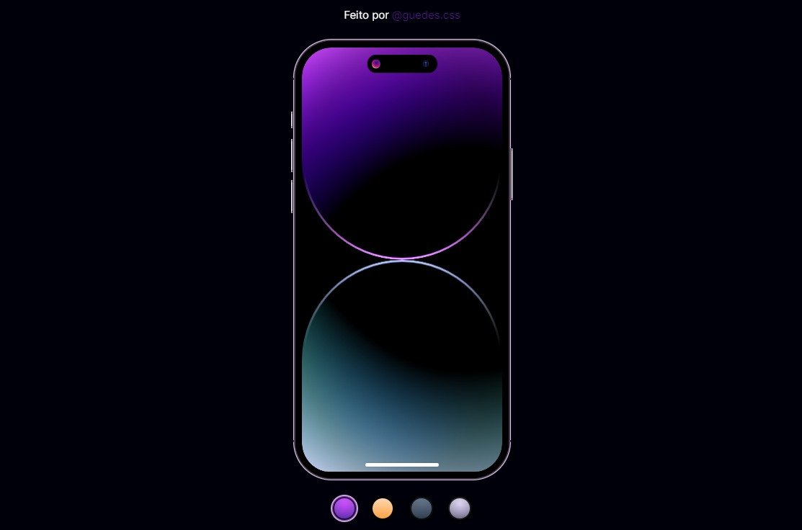

<h1 align="center"> Iphone 14 | Dynamic Islands </h1>

Programa exclusivo e gratuito.  

  <a href="#-tecnologias">Tecnologias</a>&nbsp;&nbsp;&nbsp;|&nbsp;&nbsp;&nbsp;
  <a href="#-projeto">Projeto</a>&nbsp;&nbsp;&nbsp;|&nbsp;&nbsp;&nbsp;

 

  

## 🚀 Tecnologias

Esse projeto foi desenvolvido com as seguintes tecnologias:

- HTML e CSS

## 💻 Projeto

Viewport mostrando Iphone 14 dynamic islands apenas em css e html

- [Acesse o projeto finalizado, online](https://guedescss.github.io/iphone-dynamic-islands/)

Feito by GuedesCSS :wave: